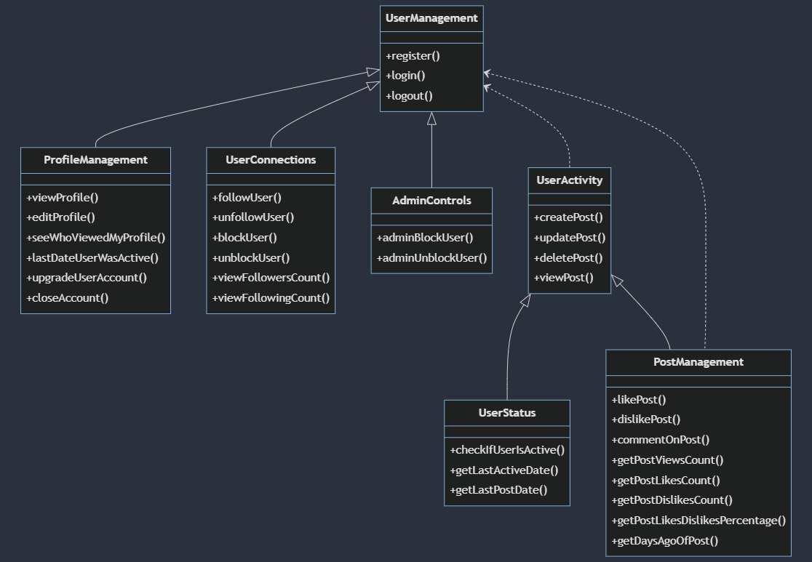

[Technology](#technology)

## Technology

- npm i jsonwebtoken (jwt.io)

## Authentication Flow

- User logs in -> generateToken creates a token
- User makes a request with the token in the header
- Middleware uses getTokenFromHeader to extract the token
- Middleware uses verifyToken to validate the token
- If the token is valid, the middleware attaches the user information to the request object (req.user)
- The request proceeds to the intended route handler
- The route handler can now access the authenticated user's information via req.user
- The route handler processes the request and sends a response
- For subsequent requests, the client continues to include the token in the header
